# Croc Chip Physical Design: RTL to GDSII

This repository documents the physical design implementation flow for `croc_chip`, from RTL/netlist handoff through floorplanning, SRAM placement, power-grid construction, place/CTS/route optimization, and timing signoff checks.

The project was implemented with Cadence Innovus using Tcl-based flow scripts, generated reports, saved design checkpoints, and post-route outputs.

## Project Overview

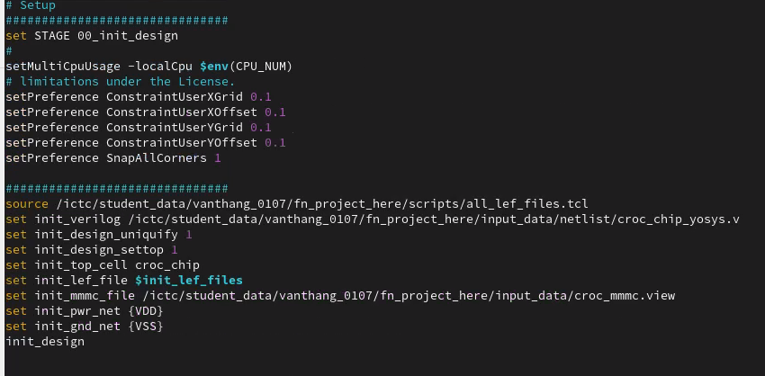

The flow uses a scripted Innovus setup with technology LEF files, standard-cell and SRAM macro LEFs, MMMC constraints, floorplan settings, and the synthesized Verilog netlist.

Main implementation stages:

1. Initialize design database and load technology/design inputs.
2. Define floorplan, core area, IO/pin placement, and utilization target.
3. Place SRAM macros with pins facing the core.
4. Build the power grid.
5. Run placement optimization.
6. Run clock tree synthesis and CTS optimization.
7. Run routing and route optimization.
8. Check setup/hold timing and generate final layout/report artifacts.

## Repository Structure

```text
.
├── input_data/          # Netlist, LEF, SDC/MMMC and design input files
├── scripts/             # Tcl scripts for each physical design stage
├── rpt/                 # Timing, design, congestion and verification reports
├── SAVED/               # Innovus saved design checkpoints
├── output/              # Final implementation outputs
├── timingReports/       # Timing reports from implementation stages
└── docs/images/         # Screenshots used by this README
```

## Flow Snapshots

### Working Directory

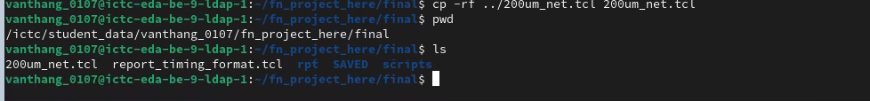

### Init Design

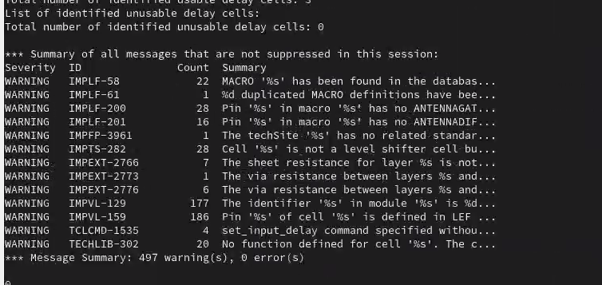

### Core Area and Utilization

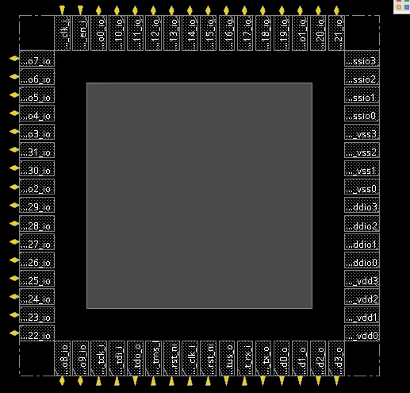

### SRAM Placement

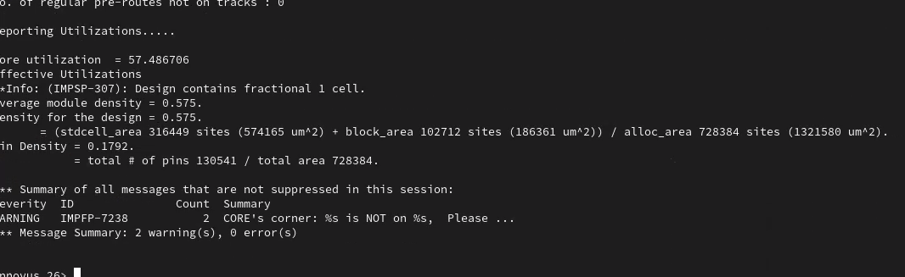

### Power Grid

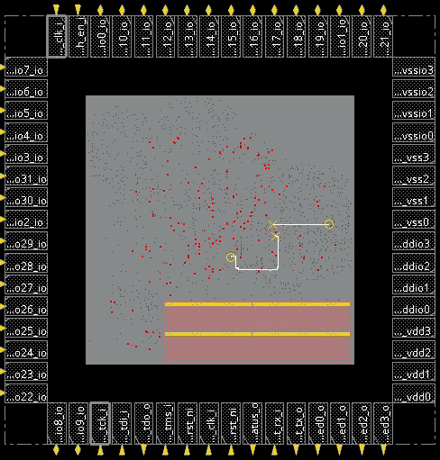

### Post-Route Layout

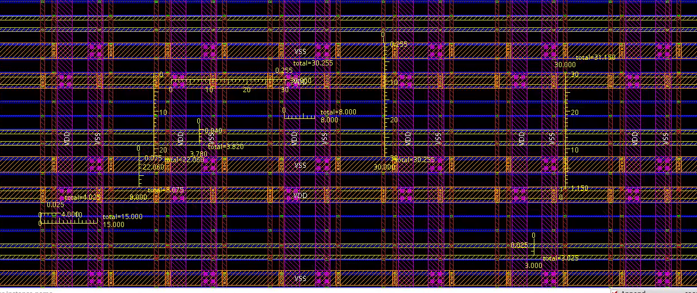

## Timing Results

### Setup Timing

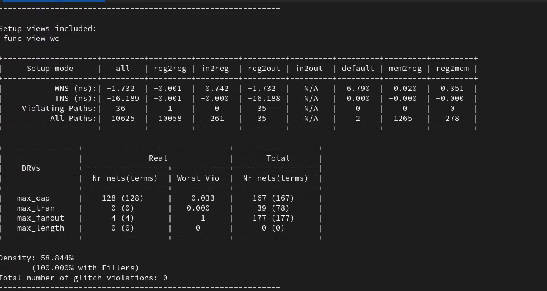

### Hold Timing

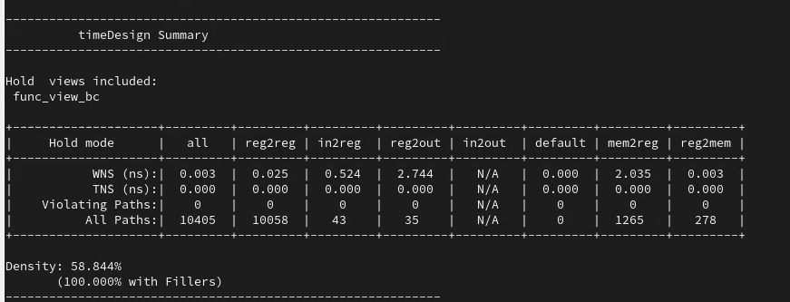

### Clock Frequency and Uncertainty

The target clock frequency used in the project is 80 MHz.

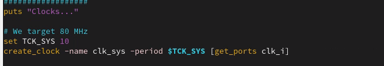

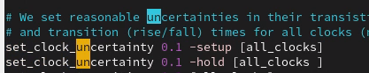

## Final Report Snapshot

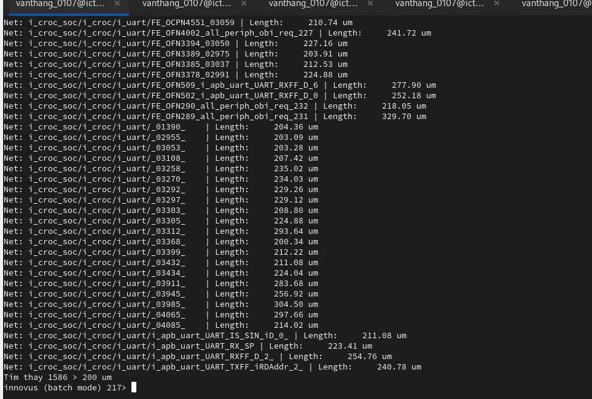

## Notes

- The design flow is script-driven so implementation stages can be repeated from Tcl files.
- Innovus logs, reports, and saved databases are included as project evidence and debug references.
- Timing reports include setup and hold checks after implementation.
- The screenshots in this README were extracted from the final project document.
