# Croc RISC-V SoC — Physical Design Flow on IHP SG13G2

Physical design (RTL/netlist → GDSII) implementation of the **croc RISC-V SoC** on the open **IHP SG13G2 130 nm** PDK, using **Cadence Innovus** with a script-driven Tcl flow.

## Design Requirements

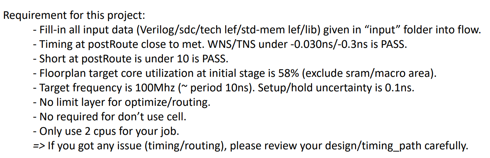

| Item | Target |
|---|---|
| Clock | 100 MHz (10 ns period) |
| Setup / hold uncertainty | 0.1 ns |
| Initial core utilization | ~58% (excluding macro area) |
| postRoute timing | WNS ≥ -0.030 ns, TNS ≥ -0.3 ns |
| postRoute shorts | < 10 |
| Routing layers | No layer restriction |
| CPUs | 2 |

## Flow Overview

1. Prepare inputs — SDC constraints, MMMC views, script paths
2. `init_design` — load tech LEF, macro LEF, netlist, libraries
3. Floorplanning — utilization, SRAM macro placement, core rows, endcaps, power grid
4. Placement + optimization
5. Clock tree synthesis (CCOpt)
6. Routing + postRoute optimization
7. Filler insertion, connectivity check, DRC, timing signoff

## 1. Preparation

### SDC constraints

Clock period 10 ns, setup/hold uncertainty 0.1 ns.

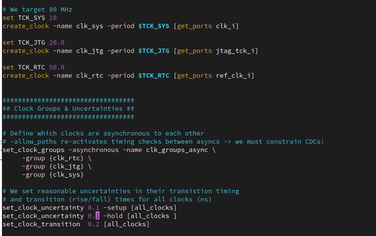

### MMMC and init settings

Libraries are grouped into typical / fast / slow corners in the MMMC view file, and the init script points to the netlist, LEFs, MMMC file and floorplan settings:

```tcl
set init_verilog   <netlist>/croc_chip_yosys.v
set init_lef_file  { <lef>/sg13g2_tech.lef
                     <lef>/sg13g2_stdcell.lef
                     <lef>/sg13g2_stdcell_weltap.lef
                     <lef>/sg13g2_io.lef
                     <lef>/sg13g2_io_notracks.lef
                     <lef>/bondpad_70x70.lef
                     <lef>/RM_IHPSG13_1P_*_bm_bist.lef }
set init_mmmc_file <input_data>/croc_mmmc.view
set init_top_cell  croc_chip
```

### init_design result

497 warnings / 0 errors — remaining warnings are library/antenna informational messages.

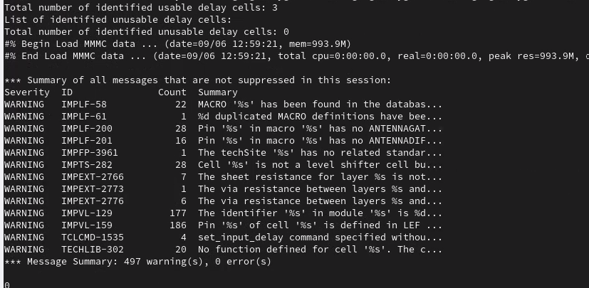

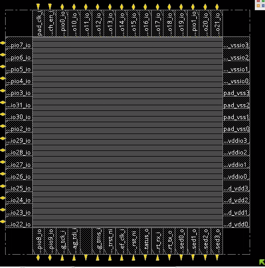

## 2. Floorplanning

Steps: set utilization → place hard macros (SRAM) → create core rows → add endcaps → build PG.

### Utilization

```tcl
floorPlan -site CoreSite -d 1840.32 1840.32 165 165 165 165
checkFPlan -reportUtil
```

Core utilization = **57.49%**, matching the ~58% target.

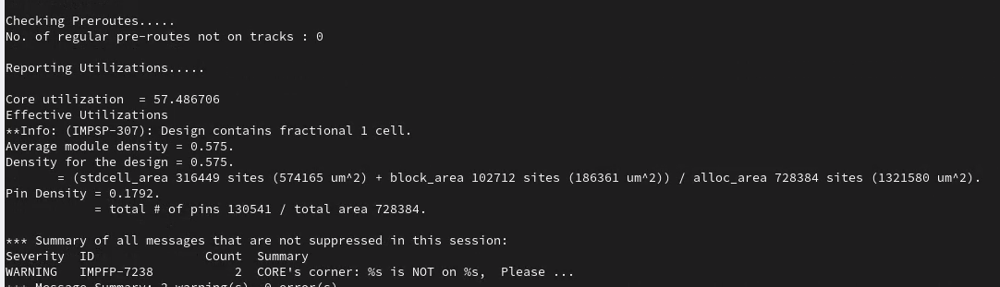

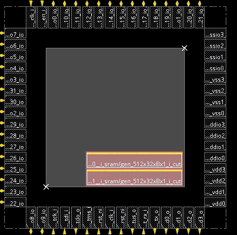

### SRAM placement

Both SRAMs are placed at a core corner with their pins facing the core center. They must not sit too close to the die edge — otherwise endcap insertion fails with *End Cap No Instance*, because the gap between macro and boundary is too small to fit an endcap cell.

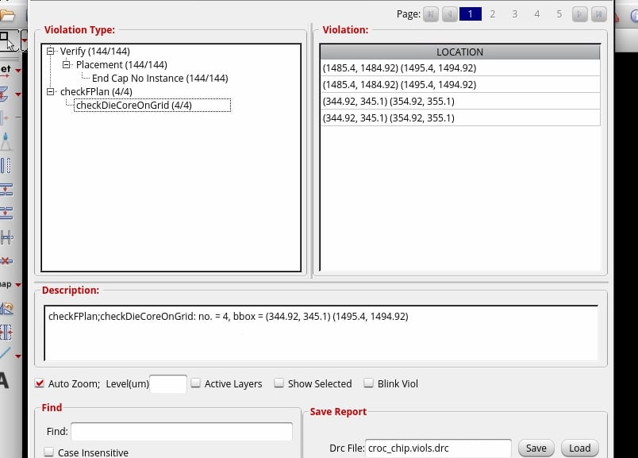

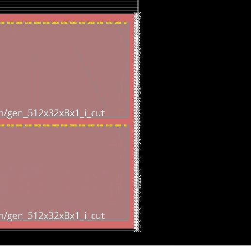

### Core rows

Core rows span the core area left to right (excluding macro-occupied regions), each one standard-cell row high (**3.78 µm**, from the `CoreSite` definition in the weltap LEF).

Procedure: delete existing core rows → `initCoreRow` → `cutRow` at macro boundaries so no standard cell lands on a hard macro.

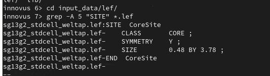

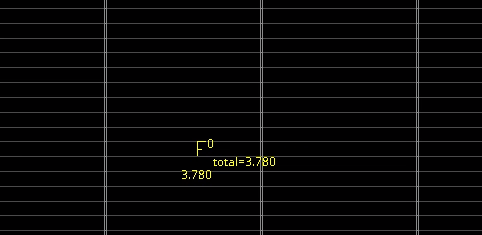

### Endcaps

Endcaps are added at both ends of every core row, including rows shortened by the SRAM macros. They close the well/diffusion structure at row edges; without them, cells at row boundaries violate DRC.

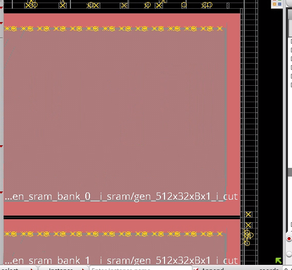

### Power grid

VDD/VSS mesh built with stripes per layer:

| Layer | Direction | Width | Set-to-set | Spacing |
|---|---|---|---|---|
| Metal3 | vertical | 1 | 10 | 2 |
| Metal4 | horizontal | 1 | 15 | 2 |
| Metal5 | vertical | 1 | 15 | 2 |
| TopMetal1 | horizontal | 4 | 30 | 4 |
| TopMetal2 | vertical | 4 | 30 | 4 |

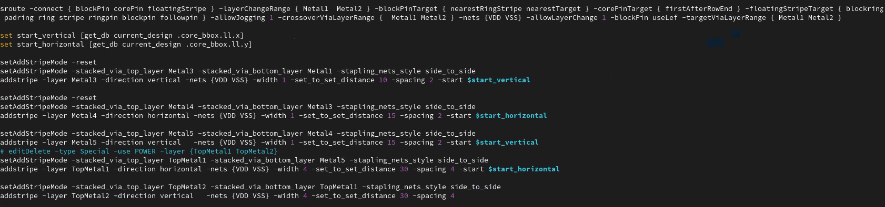

| Metal1 | Metal4 | Metal5 |
|---|---|---|
| 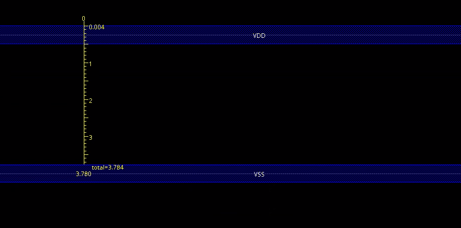 | 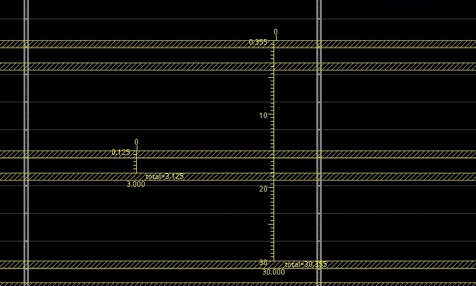 | 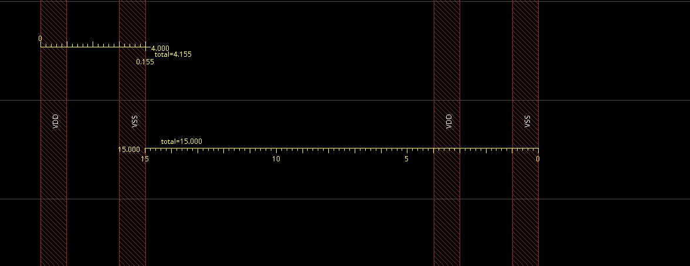 |

| TopMetal1 | TopMetal2 |
|---|---|
| 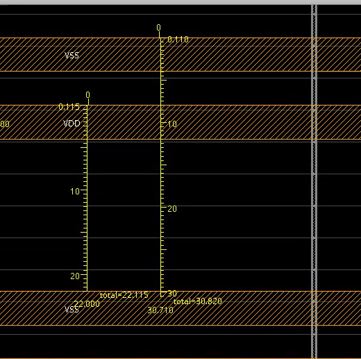 | 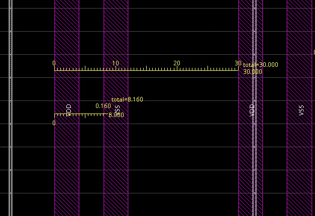 |

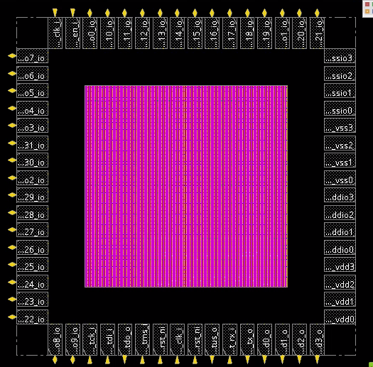

## 3. Placement

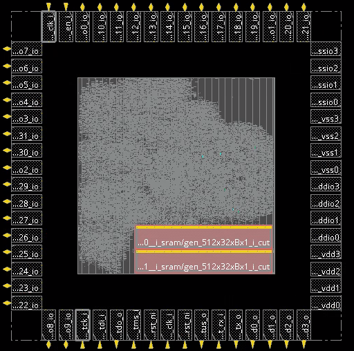

`reportCongestion` gives normalized max congestion hotspot area = 0.00 and normalized total congestion hotspot area = 0.00 — no significant local congestion anywhere in the core, including around the two SRAMs.

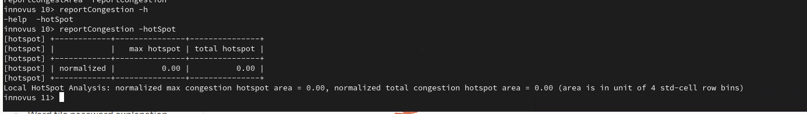

## 4. Clock Tree Synthesis

Two clock domains: the functional domain (`clk_sys`) and the DFT/JTAG domain, visible as two separate branches; the JTAG branch is shorter and shallower.

Root to sink passes through ~4–5 buffer levels. Most sinks land between ~1.2 ns and ~1.3 ns — max skew ≈ 100 ps.

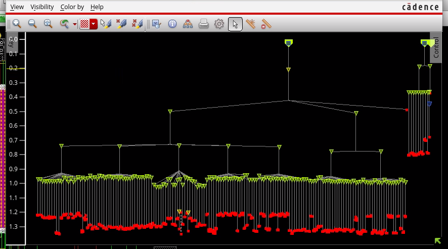

## 5. Routing and Timing

### Setup (postRoute)

`reg2reg` WNS = **+0.007 ns**, TNS = 0.000, **0 violating paths** out of 10058.

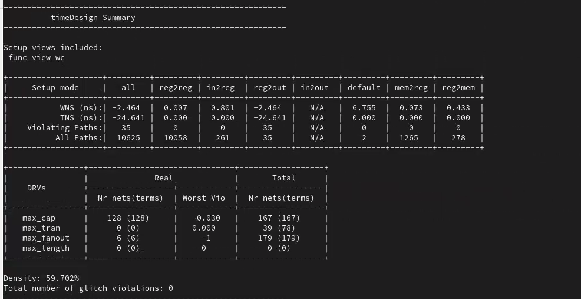

`reg2out` paths violate because the distance between core and IO pads is large and no buffer can be inserted in between (`Instance ... is not in core boundary`). This is a consequence of the given floorplan/IO requirement, so optimization focuses on `reg2reg`.

### Hold (postRoute)

WNS = **+0.019 ns**, TNS = 0.000, **0 violating paths**.

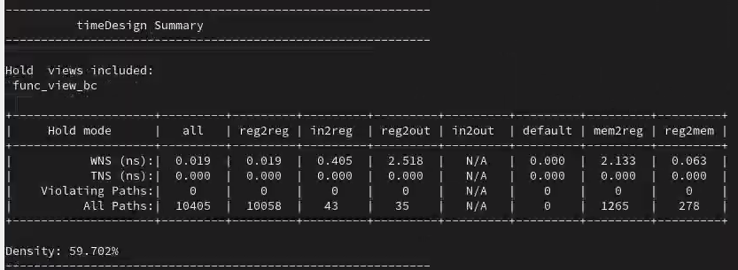

### Critical path

Slack **+0.007 ns** (required 11.225 ns, arrival 11.218 ns) on a `reg2reg` path in `i_croc_soc/i_croc/i_timer`. The path shows some detour but still meets timing.

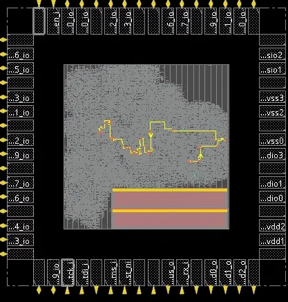

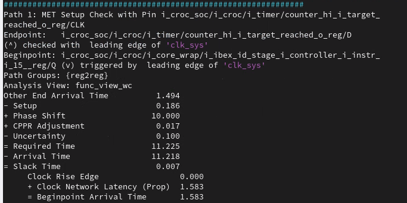

## 6. Signoff Checks

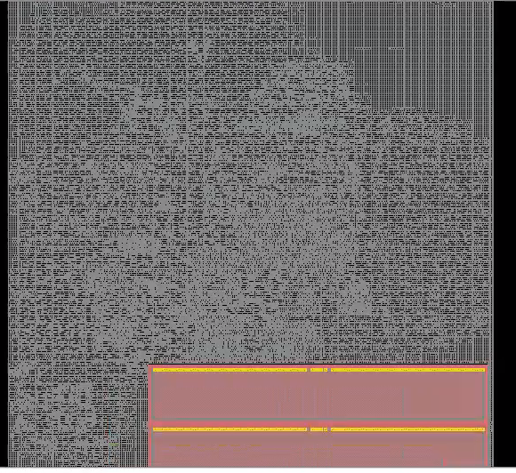

```tcl
verify_connectivity
verify_drc -limit 1000 -report drc_postRoute.rpt
```

`verify_connectivity` reports 1000 dangling-wire violations (ignored). DRC search for `short` in `drc_postRoute.rpt` returns **0** — within the requirement.

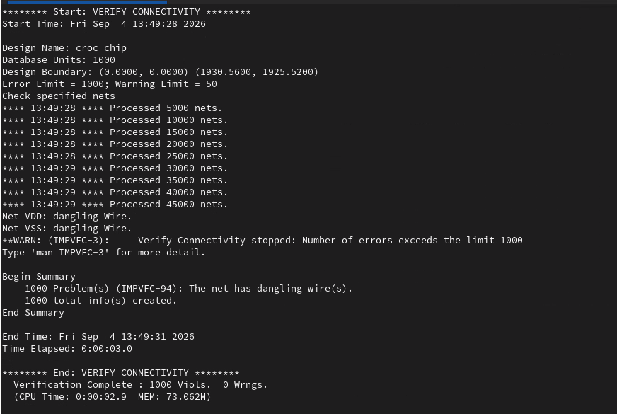

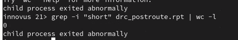

## Repository Structure

```text
.
├── input_data/          # Netlist, LEF, SDC/MMMC and design input files
├── scripts/             # Tcl scripts for each physical design stage
├── rpt/                 # Timing, design, congestion and verification reports
├── SAVED/               # Innovus saved design checkpoints
├── output/              # Final implementation outputs
├── timingReports/       # Timing reports from implementation stages
└── docs/images/         # Screenshots used by this README
```

## Results Summary

| Check | Result | Status |
|---|---|---|
| Core utilization | 57.49% | PASS |
| Setup WNS (reg2reg) | +0.007 ns | PASS |
| Setup TNS (reg2reg) | 0.000 ns | PASS |
| Hold WNS | +0.019 ns | PASS |
| Congestion hotspots | 0.00 | PASS |
| DRC shorts | 0 | PASS |

## Notes

- The flow is fully script-driven, so every stage can be re-run from its Tcl file.
- Innovus logs, reports and saved databases are kept as debug references.
- Screenshots are taken from the implementation runs; local tool paths have been removed.
